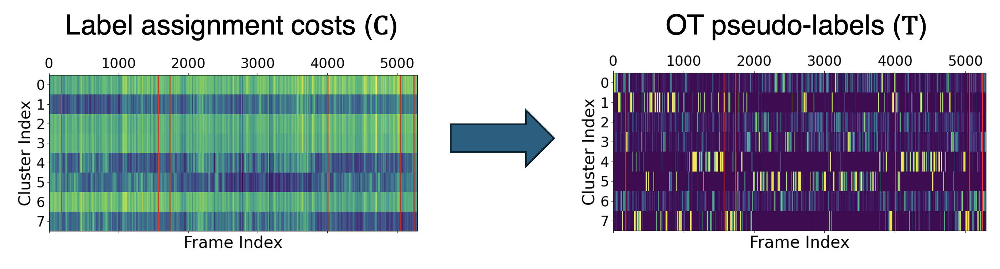
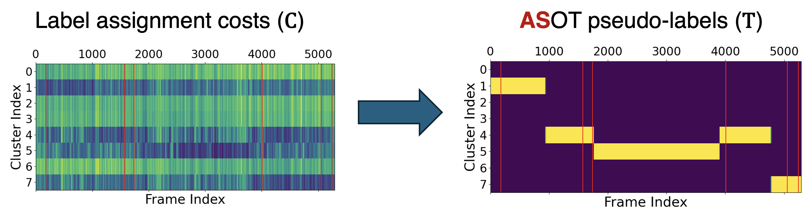
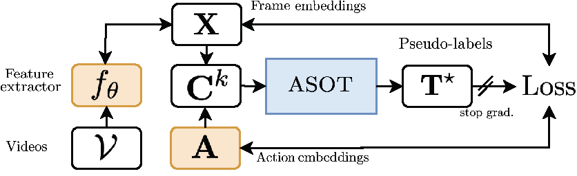
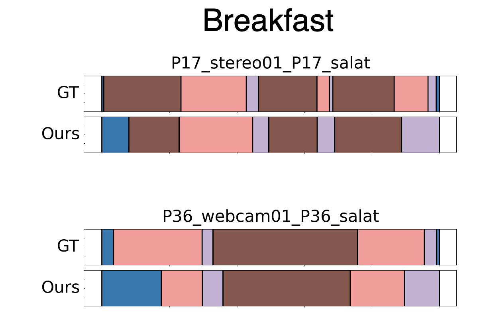
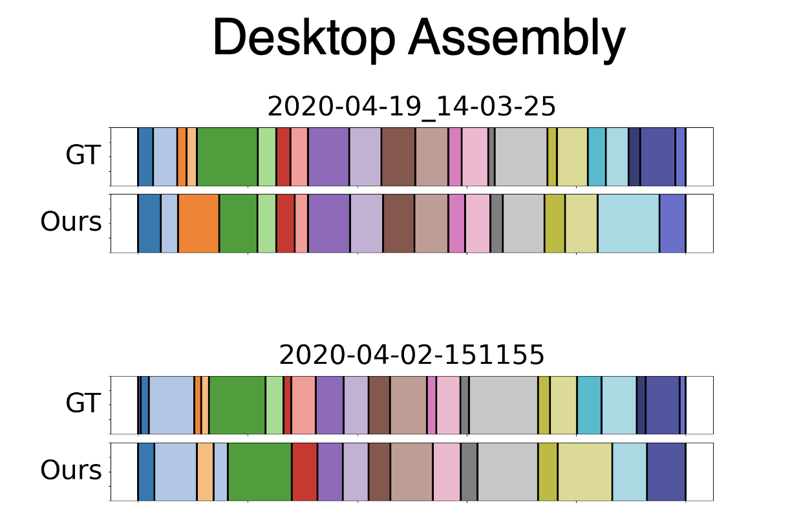

# Temporally Consistent Unbalanced Optimal Transport for Unsupervised Action Segmentation (CVPR 2024 Oral)

This repo contains a reference implementation of our proposed method Action Segmentation Optimal Transport (ASOT), accepted to CVPR 2024. We also include our full training/evaluation pipelines for the experiments in the [paper](http://arxiv.org/abs/2404.01518).

## 1. Overview: Action Segmentation Optimal Transport (ASOT)

ASOT is a technique that decodes a set of temporally consistent class predictions given a noisy affinity matrix derived from a video (or a batch of videos) for the [action segmentation task](https://arxiv.org/abs/2210.10352). We use ASOT in the context of generating pseudo-labels within an unsupervised learning pipeline based on joint representation learning and clustering, e.g., [SeLA](https://arxiv.org/abs/1911.05371) for image classification datasets. A recent method [TOT](http://openaccess.thecvf.com/content/CVPR2022/html/Kumar_Unsupervised_Action_Segmentation_by_Joint_Representation_Learning_and_Online_Clustering_CVPR_2022_paper.html) uses optimal transport (OT) for pseudo-label generation, however, the OT method proposed in that paper is not aware of

- the _temporal structure_ of the video task or
- the _long-tail action class distributions_ inherent to this task.

### Example of Standard Optimal Transport

Standard optimal transport produces pseudo-labels like this, given a raw label assignment affinity/cost matrix.



ASOT however, generates pseudo-labels that look like _this_



We use a _structure-aware optimal transport_ formulation which handles long-tail action class distributions. The temporal consistency property ineherent to videos is handled through Gromov-Wasserstein, whereas the long-tail class distributions is handled by including an unbalanced OT formulation.

### Unsupervised learning pipeline

Our unsupervised segmentation pipeline uses a joint representation learning and clustering formulation. A frame-wise feature extractor (MLP) and action cluster embeddings are jointly learned by using pseudo-labels generated per batch.



See the main paper for results and SOTA comparison. Qualitative examples of our unsupervised learning algorithm are presented below.

 

ASOT handles _repeated actions_ and _order variations_ across videos natively as part of the pseudo-labelling. 

We also find that encouraging pseudo-labels to follow a canonical order, similar to TOT also helps.

# 2. Using the Code

## Simple Example

We provide a self-contained example which shows how ASOT is used for generating pseudo-labels in `examples/`. Run `example.py` and feel free to tune the ASOT parameters.

## Re-run All Unsupervised Learning Experiments

Some setup is required to run the unsupervised learning pipeline. Steps involve installing dependencies, setting up datasets and running the train/eval scripts.

## Datasets

Our datasets are comprised of per video frame features (pre-extracted), frame-wise labels and a mapping file which maps class IDs to action class names. Download instructions and folder structure are described in this section.

Breakfast, YTI, 50 Salads: [click here](https://github.com/Annusha/unsup_temp_embed/blob/master/HOWTO_master.md) to find links to download the datasets.
Desktop assembly: [click here](https://drive.google.com/drive/folders/1m7ljnnnd5kJ_Hi4Ir-sdNZRDFSqT1sHd) to download the dataset.

The data directory should at the minimum have the following structure.

```
data                 # root path for all datasets
├─ dataset_name/                # root path for single dataset
│  ├─ features/          # pre-extracted visual frame features
│  │  ├─ fname1.npy      # can also be txt
│  │  ├─ fname2.npy      # can also be txt
│  │  ├─ ...      
|  ├─ groundTruth/       # frame-wise labels
│  │  ├─ fname1 
│  │  ├─ fname2
│  │  ├─ ...      
|  ├─ mapping/       # frame-wise labels
│  │  ├─ mapping.txt # class-to-action ID mapping
```

`dataset_name` can be one of `Breakfast  desktop_assembly  FS  YTI`. It should be easy to set up new datasets as long as the folder structure is setup correctly.

## Dependencies

`numpy scipy scikit-learn matplotlib pytorch pytorch-lightning wandb`

## Run train/eval pipeline

We provide bash scripts and python commands to run the unsupervised learning experiments described in the paper. All hyperparameters are set in the subsequent scripts/commands according to the paper and should be consistent with the reported results.

### Breakfast

Run `bash run_bf.sh`. This runs training code for each activity class separately.

### YouTube Instructions

Run `bash run_yti.sh`. This runs training code for each activity class separately.

### 50 Salads, Desktop Assembly

```
python3 train.py -d FSeval -ac all -c 12 -ne 30 --seed 0 --group main_results --rho 0.15 -lat 0.11 -vf 5 -lr 1e-3 -wd 1e-4 -ua
python3 train.py -d FS -ac all -c 19 -ne 30 -g 0 --seed 0 --group main_results --rho 0.15 -lat 0.15 -vf 5 -lr 1e-3 -wd 1e-4 -ua
python3 train.py -d desktop_assembly -ac all -c 22 -ne 30 --seed 0 --group main_results --rho 0.25 -lat 0.16 -vf 5 -lr 1e-3 -wd 1e-4 -r 0.02 -ls 512 128 40 -ua
```
